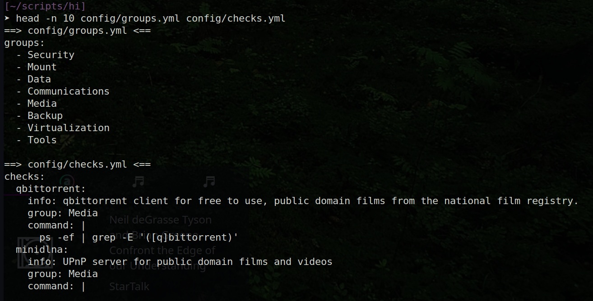

hi - Host Information
=====================

**PLEASE NOTE:** This tool is still in early development.  Things will change
quickly, and there will likely be bugs along the way.  Follow the project
to stay updated on new features and fixes.

"hi" is a command-line tool designed to monitor and display the status of various services running on a host. The services and their respective checks are customizable via a YAML configuration file, allowing for flexibility to suit different monitoring needs. This tool leverages the Rich library to provide visually pleasing output that includes UTF8 status icons, so it should be run in a terminal that supports the UTF8 character-set.

Features
--------

*   Highly customizable checks that can report on any command-line executable status.
    
*   Verifies the running status of various services.
    
*   Checks the last modified date of backup logs to ensure up-to-date backups.
    
*   Monitors the connectivity status of ExpressVPN.
    
*   Displays the local IP address and hostname of the host.
    
*   Utilizes the Rich library for visually appealing console output with UTF8 status icons.
    

Getting Started
---------------

### Prerequisites
Ensure you have the following installed on your system:

*   Python 3.x (>= 3.6)
    
*   Required Python modules:
    
    *   subprocess
        
    *   socket
        
    *   re
        
    *   os
        
    *   pyyaml
        
    *   rich
        

You can check your version of python with the following command:
`   python3 --version   `

Ensure that your terminal supports the UTF8 character set for proper display of status icons.


### Installation
1.  `git clone https://github.com/jbobbylopez/hi.git`

`cd hi`
    
2.  `pip install -r requirements.txt`

3.  `python3 host_information.py`
    

### Configuration
There are currently three (3) configuration files that 'hi' depends on.  They are as
follows:
- config/config.ini
- config/groups.yml
- config/checks.yml

#### config/config.ini ####
This file is the main configuration file that tells 'hi' what files it needs and options it should enable.

For example, you can use the 'checks_file' to specify a custom location of
the specific checks.yml formatted file you would like to use.

Also, you can configure table output options to customize how your reports
displayed.

##### checks_file #####
The 'checks_file' setting tells *hi* where YOUR custom 'checks.yml' file is located.  The checks file can be named anything,
as long as it is a properly formatted YAML file.  It should look something like the checks.yml or example.yml files that comes
with this tool.

config.ini example:
```
[Paths]
checks_file = config/checks.yml
[Tables]
number_of_columns = 2 

```

#### config/groups.yml ####
*hi* "status groups" typically referred to simply as "groups" can be customized in the `  config/groups.yml  ` file, and only those system checks
configured with those specific groups defined will be reported.

The following is how the groups.yml file should be configured.  You can
either keep these same group names, or modify and rename them to whatever
you like.

` config/groups.yml ` example:
```
groups:
  - Security
  - Mount
  - Data
  - Communications
  - Media
  - Backup
  - Virtualization
  - Tools
```

#### config/checks.yml ####
This is where the magic happens.  The `  config/checks.yml  ` file is where
your system status checks are defined.  This file can be renamed to
anything you want, but the new name or location will need to be updated in
your `config.ini` file for it to be used.

This configuration file allows you to define any number of system status checks to monitor services or functionalities available via the command line.

Example configuration reference:
```
checks:
  qbittorrent:
    info: My bittorrent client
    group: Media
    command: |
      ps -ef | grep -E '([q]bittorrent)'
  ...
```

Several examples of various system status checks are available for review
or reuse in the ` config/checks.yml ` file that comes with this tool.


### sub-checks
You can now define multiple sub-checks using the same check declaration pattern.

Here's an example of how sub-checks are configured.  We will use the
'Thunderbird' check which comes pre-defined in config/checks.yml.

In the following check defined for Thunderbird, you can see that not only is the
main check for the running process in place, but there are also two
sub-checks defined for checking Thunderbird's 'Memory Usage' and 'Version'
information.

```
  Thunderbird:                                                                                                                                   │                                                                         │ [❌] Midnight Commander is stopped                                     
     info: My favorite mail client                                                                                                                │                                                                         │ [✅] tmux is running                                                   
     group: Communications                                                                                                                        │                                                                         ╵                                                                        
     indicators:                                                                                                                                  │Operating System: Ubuntu 22.04 | End of Life: 2027-04-01 (2 years, 8 months, 3 weeks, and 4 days remaining)
       positive:                                                                                                                                  │Filesystem                    Used            Total           Free            Bar                                               % Used
         status:                                                                                                                                  │root (/)                      364.8 GB        478.9 GB        89.7 GB         [====================================---------]>   80.3%
         icon: 📧                                                                                                                                 │/media/jbl/vdc2022nas         2.0 TB          3.6 TB          1.4 TB          [==========================-------------------]>   59.9%
       negative:                                                                                                                                  │/media/jbl/jbl-backup-sg1tb   174.9 GB        915.8 GB        694.3 GB        [=========------------------------------------]>   20.1%
         status:                                                                                                                                  │
         icon: 📧                                                                                                                                 │VPN: Connected to Canada - Toronto
     command: |                                                                                                                                   │jbl@vdc 2024-Jul-09 (Tuesday) 03:25:23 AM (dev-subchecks) 
       ps -ef | grep -E "[t]hunderbird"                                                                                                           │[~/scripts/hi] 
     sub_checks:                                                                                                                                  │➤ pytest -v test_host_information.py 
       Memory Usage:                                                                                                                              │============================================================== test session starts ===============================================================
         command: |                                                                                                                               │platform linux -- Python 3.10.12, pytest-8.2.2, pluggy-1.5.0 -- /usr/bin/python3
           ps --no-headers -o rss -C thunderbird | awk '{sum+=$1} END {printf "%.2f MB (%.2f GB)\n", sum/1024, sum/1048576}'                      │cachedir: .pytest_cache
         indicators:                                                                                                                              │rootdir: /home/jbl/Sources/hi
           positive:                                                                                                                              │plugins: anyio-4.2.0
               icon: 💾                                                                                                                           │collected 4 items                                                                                                                                
           negative:                                                                                                                              │
               icon: 💾                                                                                                                           │test_host_information.py::test_host_information_header_line_in_output PASSED                                                               [ 25%]
       Version:                                                                                                                                   │test_host_information.py::test_host_information_get_ip_address PASSED                                                                      [ 50%]
         command: |                                                                                                                               │test_host_information.py::test_df_bargraph_output PASSED                                                                                   [ 75%]
           thunderbird --version
```
### Custom Indicators

In the above Thunderbird check configuration example, you can also see the
custom indicators which can be defined within the config/checks.yml file.

These custom indicators, when defined, will override the default check
'hi' check indicators (in most cases).

You can see that custom indicators have been defined not just for
Thunderbird, but also for it's 'Memory Usage' sub-check.  The 'Version'
sub-check does not have any indicators defined, and so that sub-check will
use the default indicators.

An example of what the output looks like when `  hi info  ` is run:


As you can see, the check description (info field), along with the
sub-checks are indented slightly from the main checks so that they are
nicely grouped together.

### Usage
1.  `python3 host_information.py`
    
2.  **(Optional)** Set up a bash function and alias to run the script more easily.
    

Add an alias to your ~/.bashrc to call this script:

`alias hi="python3 /home/jbl/scripts/hi/host_information.py $@"`

After adding these lines, save the ~/.bashrc file and apply the changes:
`source ~/.bashrc`

Now you can run the script using the command:
`hi`

#### Options and Arguments
Arguments:

-  'info': Show check description and sub-checks.
-  'watch': Native watch command for ongoing monitoring.


### Example Output ###
Here's an example of how the output will appear:


An example of verbose output, showing the system check 'info:' field data:


### How It Works ###
The main section is a set of one or more two-column tables with group names
for their column headers.

Within each column, a list of system checks are displayed, showing either
disabled/enabled, or active/inactive, represented by [❌] and [✅]
respectively. Different indicators may be employed based on the groups
configured.  For example, the Tools group uses the [💡] and [⚫]
indicators.

After the system checks, two other pieces of system information are 
displayed.  The Operating System End-of-Life date, and a filesystem
utilization summary.  This section looks like the following:


Groups can be customized in the config/groups.yml file, and only those system checks
configured with the groups defined will be reported.

Example of the groups.yml and checks.yml configuration files:



### Behind The Scenes ###
To get an idea of how this all comes together, consider the following:

*Configuration Loading:* The script starts by loading the YAML configuration file (config/checks.yml). This file specifies different services and checks categorized into groups such as Media, Tools, Security, Backup, Data, and Mount.
```
def get_checks_yaml(checks_yaml):
    with open(checks_yaml, 'r') as file:
        checks = yaml.safe_load(file)
    return checks
```
*Execution of Commands:* For each defined service, the corresponding command is executed using the subprocess.run method. The output of these commands determines the status of each service. The shell=True option allows the commands to be run in the shell, making it compatible with commands involving pipes and other shell features.
```
def check_process(process, command):
    result = subprocess.run(command, shell=True, capture_output=True, text=True)
    return result.stdout
```


### Customizing the Checks ###
The config/checks.yml file defines the checks that the tool will perform. Each entry in the file specifies a group and a command.
- group: The category of the service (e.g., Tools, Data, Backup, Media, Security, Mount).
- command: The shell command to check the status of the service.

You can add or modify checks to suit your needs. For example:
```
new_service:
  group: Tools
  command: ps -ef | grep -i "[n]ew_service"
```

For an example of a more complex check, take a look at the one defined for ExpressVPN:
```
   ExpressVPN:
     info: For general privacy and security.
     group: Security
     command: |
       expressvpn status | grep -i connected | sed "s/\\x1b\\[[0-9;]*[mGK]//g"
```
In the case of ExpressVPN, I'm not just interested in checking if the process is running, I'm also
interested in capturing a portion of the command output to be included in the reporting output of 'hi'.

In order to leverage that output, there is a custom handler defined in `host_information.py`:
```
         elif 'expressvpn' in process.lower():    
             if re.search("Connected", output.strip()):    
                 output_messages.append(f"[✅] {process} Status: {output.strip()}")    
             else:    
                 output_messages.append(f"[❌] {process} Status: {output.strip()}")
```

You can review all the existing checks defined in `config/checks.yml` for more examples.


#### hi watch
'hi' no longer uses the linux 'watch' command for continuous monitoring.
Instead a new, native watch command is available that retains the correct
output formatting in the terminal. 

To use the watch command, all you have to do now is run one of the
following commands:

`  hi watch   `
`  hi watch info  `

The command would monitor the output of 'hi' every 2 seconds, and update
your terminal output accordingly.


### Contributing ###
1. Fork the repository.
2. Create your feature branch (git checkout -b feature/awesome-feature).
3. Commit your changes (git commit -m 'Add some awesome feature').
4. Push to the branch (git push origin feature/awesome-feature).
5. Open a Pull Request.

### Testing ###
Preliminary tests have been defined in `test_host_information.py`, many
more are expected to be added as the code for this tool increases in
complexity.  You can run the tests yourself as follows:
    `pytest -v test_host_information.py`

### License ###
This project is licensed under the MIT License. See the LICENSE file for details.

### Acknowledgements ###
Inspiration for this tool has come from various sources, including btop, glances, htop, and midnight commander.

### Contact ###
Want to talk about this tool? Feel free to reach me via github or linkedin.

### Note ###

This tool has so far only been tested with the following system specifications:

------------------- 
- OS: Kubuntu 22.04.4 LTS x86_64 
- Kernel: 5.15.0-112-generic 
- Shell: bash 5.1.16 
- Python: 3.10.12.
- DE: Plasma 5.25.5 
- WM: KWin 
- Theme: Breeze Light [Plasma], Breeze [GTK3] 
- Icons: [Plasma], candy-icons [GTK2/3]

It is possible that your OS + Python version combination, or some aspect of
your OS or distro configuration may result in errors being thrown by this tool if
you attempt to use it.  

I of course take no responsibility for any harm this tool may cause to your
system.  You use this tool at your own risk.

I would however like to learn of any issues experienced using this tool.
If you happen to hit a bug or exception, or something doesn't look right,
kindly file a GitHub issue with the error details. Provide full error details,
along with your OS and system specifications. 

Please and thanks!
